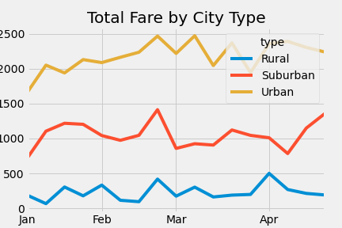
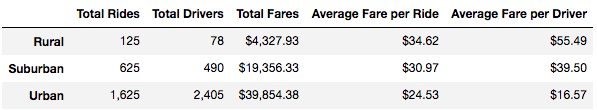

# Ride Sharing Data by City Type -- Overview
We've been tasked with creating a summary DataFrame of the ride-sharing data by city type and creating a multiple-line graph that shows the total weekly fares for each city type. In the analysis, we'll attempt to show how the data differs by city type and how those differences can be used by decision-makers at PyBer.

## Resources
- Data Source: ride_data.csv; city_data.csv
- Software: Python 3.7.6, Jupyter Notebook

## Summary
As shown in the table below, among our sample collected, both the average fare per ride and average fare per driver were less in Urban areas and most in Rural areas.  There is no adjustment for miles traveled in the data, so one possible explanation is that trip distance is lower in Urban areas, which would lead to a lower fare per ride.  

## Recommendations
To address disparities in fares between rides, one recommendation is to charge different rates between Urban, Suburban, and Rural areas.  Another recommendation is to add an upfront fee that is contigent on the type of area.  A final recommendation is to tie rates to miles traveled so that the first mile is the most expensive, and gradually declines as vehicle miles increase.    

